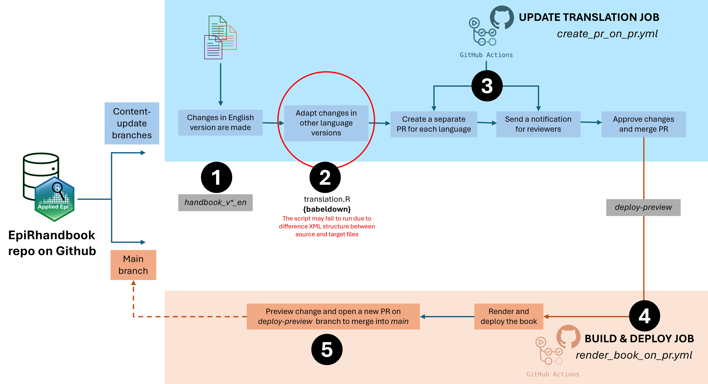

# Development Process for Action Workflow
This document outlines the steps and processes involved in developing and maintaining the action workflow for updating translations and deploying changes in the EpiRhandbook repository.

## Overview
The workflow consists of five main steps, which are executed using GitHub Actions. The process starts with updating content in the English version of the handbook and ends with rendering and deploying the book. The following sections detail each step of the workflow.




### 1. Create a new branch

The English version is the standard language, and changes are always made in the English version first, then adapted to other languages.  First, create a new branch based on the `master` branch following this name pattern `handbook_v*_en`, such as `handbook_v2.1.1_en`. 

```sh
# Fetch the latest updates from the remote repository
git fetch origin

# Check out the master branch
git checkout master

# Pull the latest changes from the remote master branch
git pull origin master

# Create a new branch based on the master branch
# Replace 'v2.1.1' with the appropriate version number
git checkout -b handbook_v2.1.1_en

# Push the new branch to the remote repository
git push origin handbook_v2.1.1_en
```

### 2. Implement changes in the English version

Open file `index.qmd` and edit some text, i.e. update the number of users. Then commit and push the changes to the remote repository.

```sh
# Add all changes to the staging area
git add .

# Commit the changes with detail message
git commit -m "Update number of user"

# Push the changes to the remote repository
git push origin handbook_v2.1.1_en

```

Open file `basic.qmd` and add a new code block for basic function in the `Simple functions` section. 

```r
log10(1000)
```

Then commit and push the changes to the remote repository.

```sh
# Add all changes to the staging area
git add .

# Commit the changes with detail message
git commit -m "Add an example of simple function in R"

# Push the changes to the remote repository
git push origin handbook_v2.1.1_en

```

### 3. Update Translation Job

Github Action file: `create_pr_on_pr.yml`

Whenever a change is committed and pushed from the EN branch, the Github Action will create a PR for each language version and update them. The PR is intended to be merged into the `deploy-preview` branch. The author in charge for the language version will also receive email for every new change made in the EN branch

Each PR will have checkboxes for each commit of the English PR (and links to those commits). The checkboxes are to help the language lead author and the coordinator track their work before they merge to the `deploy-preview` branch.

### 4. Build & Deploy Job

Github Action file: `render_book_on_pr.yml`

Intended branch to merge: `deploy-preview`

Authors of language versions will checkout the according branch, review the PR and merge the PR into the deploy-preview branch. It will trigger the Github Action for build and deploying (`render_book_on_pr.yml`).

### 5. Preview changes and merge to Main branch

Intended branch to merge: `master`

The coordinator preview changes in the Netlify site associated with the repo, make sure all changes made in the EN version are updated to the language version. Then open a new PR and merge the `deploy-preview` branch into the `master` branch to update the official version

